# SDK Environment & Version Management

## 🎯 **Overview**
This documents the separation between staging and production environments for the D-ID Client SDK.

## 📦 **NPM Packages**

| Environment | Package Name | Trigger | Purpose |
|------------|--------------|---------|---------|
| **Staging** | `@d-id/client-sdk-staging` | Auto on `main` push | Development & E2E testing |
| **Production** | `@d-id/client-sdk` | Manual via GitHub Actions | Production releases |

## 🔄 **Deployment Flow**

```mermaid
flowchart TD
    A[Developer commits to main] --> B[Auto Staging Deploy]
    B --> C[Publish @d-id/client-sdk-staging]
    C --> D[Trigger agents-ui E2E]
    D --> E{E2E Pass?}
    E -->|✅ Pass| F[Ready for Prod Deploy]
    E -->|❌ Fail| G[Fix Issues]
    G --> A
    F --> H[Manual: Protected Prod Deploy]
    H --> I[Validate E2E Status]
    I --> J[Deploy @d-id/client-sdk]
```



## 🛡️ **Protection Mechanisms**

### **Staging → Production Requirements**
1. ✅ E2E tests must pass on `main` branch
2. ✅ Manual approval via GitHub Actions
3. ✅ Version consistency validation

### **Branch Protection**
- Use `protected-prod-deploy.yml` for safe production deployments
- Enforces E2E validation before production release

## 🔧 **Workflows Available**

| Workflow | Purpose | Trigger |
|----------|---------|---------|
| `publish-staging.yml` | Deploy staging package | Auto on `main` push |
| `publish-prod.yml` | Deploy production package | Manual dispatch |
| `protected-prod-deploy.yml` | **Safe** production deploy | Manual dispatch (validates E2E) |
| `test-sdk-environment.yml` | Test SDK versions | Manual testing |
| `e2e_sdk_pr.yml` *(agents-ui)* | Run E2E tests | Triggered by SDK staging |

## 🧪 **Testing Environment Separation**

### **Local Development Testing**
```bash
# Test staging SDK with staging environment
yarn add @d-id/client-sdk@npm:@d-id/client-sdk-staging@1.1.0-beta.6
NODE_ENV=staging yarn test:staging

# Test production SDK with production environment  
yarn add @d-id/client-sdk@1.1.0-beta.5
NODE_ENV=production yarn test:prod
```

### **CI/CD Testing**
- Use `test-sdk-environment.yml` workflow for validation
- Supports both staging and production environment testing

## 🔑 **Required Secrets**

### **agents-sdk Repository**
- `NPM_TOKEN` - For publishing to NPM
- `PAT_FOR_DISPATCH` - For triggering cross-repo workflows

### **agents-ui Repository**  
- `PAT_FOR_DISPATCH` - For updating SDK commit status
- `E2E_USER_APIKEY_STAGING` - For staging E2E tests
- `VITE_CLIENT_KEY_STAGING` - For staging environment

## ✅ **Validation Checklist**

- [ ] Staging package publishes automatically on `main` push
- [ ] E2E tests run in agents-ui after staging publish
- [ ] Production deploy requires passing E2E status
- [ ] Version bumping works correctly
- [ ] Environment separation is maintained
- [ ] Cross-repo status updates work
